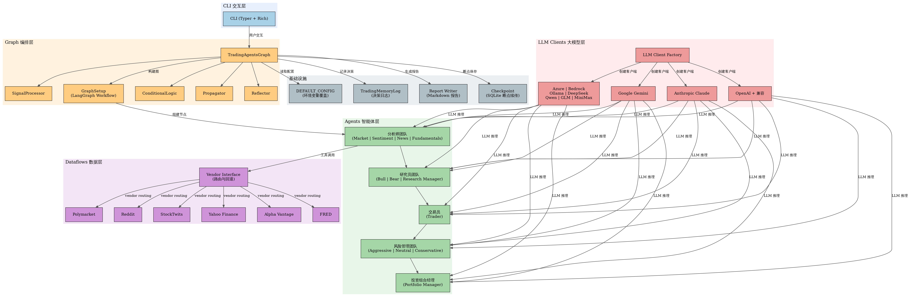
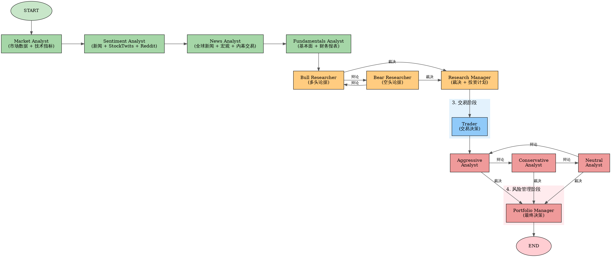

# TradingAgents 项目架构分析文档

> **Multi-Agents LLM Financial Trading Framework**  
> 版本: v0.3.0 | 日期: 2026-06-29 | TauricResearch

---

## 目录

1. [项目概述](#1-项目概述)
2. [架构全景图](#2-架构全景图)
3. [Agent 流水线与数据流](#3-agent-流水线与数据流)
4. [核心模块详解](#4-核心模块详解)
5. [关键设计模式](#5-关键设计模式)
6. [配置系统](#6-配置系统)
7. [技术栈总览](#7-技术栈总览)
8. [项目目录结构](#8-项目目录结构)
9. [总结](#9-总结)

---

## 1. 项目概述

TradingAgents 是一个基于大语言模型（LLM）的多智能体（Multi-Agent）金融交易框架，由 TauricResearch 团队开发并开源（[arXiv: 2412.20138](https://arxiv.org/abs/2412.20138)）。该项目通过模拟真实交易公司的运作模式，将复杂的交易决策任务分解给多个专业化 LLM 智能体，通过协作分析、结构化辩论和风险评估来生成交易决策。

**核心设计理念：** 将交易决策拆解为"分析师研究 → 多空辩论 → 交易执行 → 风险评估 → 组合管理"的流水线，每个环节由专门的 LLM Agent 负责，Agent 之间通过 LangGraph 状态图进行编排和消息传递。

---

## 2. 架构全景图



架构分为六层，自顶向下依次为：

### 2.1 CLI 交互层

位于最上层，负责与用户交互。基于 **Typer** 框架构建命令行界面，使用 **Rich** 库实现终端美化渲染。提供交互式选股、LLM 提供商选择、研究深度配置等功能。

### 2.2 Graph 编排层

核心编排层，以 `TradingAgentsGraph` 为主控类，内部使用 **LangGraph** 的 `StateGraph` 构建多智能体工作流。包含以下关键组件：

- **GraphSetup**：负责构建 LangGraph 状态图，注册所有 Agent 节点和条件边
- **ConditionalLogic**：定义图中的条件跳转逻辑（分析师工具循环、辩论轮次控制）
- **Propagator**：状态初始化和图执行参数管理
- **Reflector**：事后反思，基于实际收益生成经验教训
- **SignalProcessor**：从最终决策中提取五级评分（Buy/Overweight/Hold/Underweight/Sell）

### 2.3 Agents 智能体层

包含所有专业化 LLM Agent 的实现，分为四大团队：

- **分析师团队（Analyst Team）**：Market Analyst、Sentiment Analyst、News Analyst、Fundamentals Analyst
- **研究员团队（Research Team）**：Bull Researcher、Bear Researcher、Research Manager
- **交易员（Trader）**：将研究计划转化为具体交易方案
- **风险管理团队（Risk Management）**：Aggressive / Neutral / Conservative Analyst + Portfolio Manager

### 2.4 Dataflows 数据层

提供多供应商数据获取能力，通过 Vendor Interface 实现统一路由和自动回退。支持的数据源：

| 供应商 | 类别 | 数据类型 | API 要求 |
|--------|------|----------|----------|
| Yahoo Finance | Core / Technical / Fundamental / News | OHLCV、技术指标、财报、新闻 | 无需 API Key |
| Alpha Vantage | All categories | 股票、指标、基本面、新闻 | ALPHA_VANTAGE_API_KEY |
| FRED | Macro Data | 利率、通胀、就业、GDP | FRED_API_KEY |
| Polymarket | Prediction Markets | 预测市场价格 | 无需 API Key |
| Reddit | News Data | 社交媒体情绪 | 无需 API Key |
| StockTwits | News Data | 投资社区情绪 | 无需 API Key |

### 2.5 LLM Clients 大模型层

通过工厂模式统一管理多 LLM 提供商的客户端。支持的提供商：

- **原生客户端**：OpenAI（GPT-5.x）、Google（Gemini）、Anthropic（Claude）、Azure OpenAI、AWS Bedrock
- **OpenAI 兼容客户端**：xAI（Grok）、DeepSeek、Qwen（DashScope）、GLM（Zhipu）、MiniMax、OpenRouter、Ollama

### 2.6 基础设施层

提供持久化、报告生成和配置管理等横切能力：

- **TradingMemoryLog**：基于 Markdown 的追加式决策日志，支持事后反思和经验注入
- **Checkpoint（SQLite）**：基于 LangGraph Checkpoint 的断点续传机制
- **Report Writer**：多级 Markdown 报告生成（分析师 → 研究 → 交易 → 风险 → 组合）
- **DEFAULT_CONFIG**：统一配置系统，支持环境变量覆盖（`TRADINGAGENTS_*`）

---

## 3. Agent 流水线与数据流



单次分析任务的完整 Agent 流水线如下：

### 3.1 阶段一：分析师研究

四位分析师按顺序执行，每位分析师通过 Tool Calling 机制调用数据工具获取所需信息：

- **Market Analyst**：获取 OHLCV 价格数据 + 技术指标（MACD、RSI 等），分析市场走势
- **Sentiment Analyst**：聚合新闻标题、StockTwits 和 Reddit 讨论，生成结构化情绪报告
- **News Analyst**：监控全球新闻和宏观经济指标，评估事件对市场的影响
- **Fundamentals Analyst**：评估公司财务数据（资产负债表、现金流量表、利润表），识别内在价值

每位分析师通过 `ConditionalLogic` 的 `should_continue_*` 方法在"LLM 推理 → 工具调用"之间循环，直到 LLM 决定不再需要调用工具。

### 3.2 阶段二：研究员多空辩论

Bull Researcher 和 Bear Researcher 基于分析师报告进行结构化辩论。辩论轮次由 `max_debate_rounds` 配置控制（默认 1 轮）。辩论结束后，Research Manager 综合双方论点，利用 Deep Thinking LLM 生成结构化投资计划（ResearchPlan），包含五级评分、理据和战略行动。

### 3.3 阶段三：交易决策

Trader 接收 Research Manager 的投资计划和分析师报告，将其转化为具体的交易方案（TraderProposal），包含：操作方向（Buy/Hold/Sell）、推理、入场价格、止损价格、仓位规模。

### 3.4 阶段四：风险管理三角辩论

Aggressive、Neutral、Conservative 三位风险分析师基于交易方案进行三角辩论（风险轮次由 `max_risk_discuss_rounds` 控制）。辩论结束后，Portfolio Manager 使用 Deep Thinking LLM 做出最终决策（PortfolioDecision），包含五级评分、执行摘要、投资论点、目标价格和时间周期。

---

## 4. 核心模块详解

### 4.1 `tradingagents/graph/` — 图编排层

#### TradingAgentsGraph（主控类）

整个框架的入口和中枢。负责：

- LLM 客户端初始化：根据 `llm_provider` 配置创建 Deep Thinking 和 Quick Thinking 两个 LLM 实例
- 工具节点创建：为四类分析师分别创建 LangGraph ToolNode，绑定对应的数据工具
- 组件初始化：ConditionalLogic、GraphSetup、Propagator、Reflector、SignalProcessor
- 图编译与执行：调用 `graph_setup.setup_graph()` 构建 StateGraph，编译后执行 `propagate()`
- 状态持久化：将执行结果写入 JSON 日志和 Markdown 记忆日志
- 事后反思：`resolve_pending_entries()` 在下次运行时解析待处理条目的实际收益

```python
from tradingagents.graph.trading_graph import TradingAgentsGraph
from tradingagents.default_config import DEFAULT_CONFIG

ta = TradingAgentsGraph(debug=True, config=DEFAULT_CONFIG.copy())
_, decision = ta.propagate("NVDA", "2026-01-15")
print(decision)
```

#### GraphSetup（图构建器）

根据 `selected_analysts` 参数动态构建 LangGraph StateGraph：

- 分析师节点：每种分析师类型对应 3 个节点（Agent、Tool、Clear），通过 AnalystExecutionPlan 管理
- 研究员节点：Bull Researcher、Bear Researcher、Research Manager
- 交易与风险节点：Trader、Aggressive/Neutral/Conservative Analyst、Portfolio Manager
- 边定义：条件边（分析师工具循环、辩论循环）+ 普通边（顺序流转）

#### ConditionalLogic（条件逻辑）

所有图内条件跳转的集中定义。`should_continue_{analyst}` 方法检查最后一条消息是否包含 `tool_calls`，决定继续调用工具还是进入清理阶段。`should_continue_debate` 和 `should_continue_risk_analysis` 通过计数器和响应前缀控制辩论轮次。

### 4.2 `tradingagents/agents/` — 智能体层

#### Agent 状态定义

`AgentState` 继承自 LangGraph 的 `MessagesState`，扩展了投资分析所需的全部状态字段：

- **基础信息**：`company_of_interest`、`asset_type`、`instrument_context`、`trade_date`
- **分析报告**：`market_report`、`sentiment_report`、`news_report`、`fundamentals_report`
- **投资辩论**：`investment_debate_state`（InvestDebateState 类型）
- **交易计划**：`trader_investment_plan`
- **风险辩论**：`risk_debate_state`（RiskDebateState 类型）
- **最终决策**：`final_trade_decision`
- **记忆上下文**：`past_context`（来自历史决策日志的反思经验）

#### 结构化输出 Schemas

四个关键 Agent 使用 Pydantic 模型实现结构化输出，确保跨 LLM 提供商的一致性：

| Schema | Agent | 关键字段 |
|--------|-------|----------|
| `ResearchPlan` | Research Manager | recommendation（5级）、rationale、strategic_actions |
| `TraderProposal` | Trader | action（Buy/Hold/Sell）、reasoning、entry_price、stop_loss、position_sizing |
| `PortfolioDecision` | Portfolio Manager | rating、executive_summary、investment_thesis、price_target、time_horizon |
| `SentimentReport` | Sentiment Analyst | overall_band（6档）、overall_score（0-10）、confidence、narrative |

#### Tool Calling 机制

分析师 Agent 通过 LangGraph 的 `ToolNode` 机制调用数据工具。每个工具函数通过 `@tool` 装饰器注册，LLM 根据提示词自主决定何时调用工具、调用哪些工具。工具调用结果直接追加到消息历史中，直到 LLM 认为信息充足后停止调用。

### 4.3 `tradingagents/dataflows/` — 数据层

#### Vendor Interface（供应商路由）

数据层的核心设计模式是"统一接口 + 多供应商回退"。所有数据工具通过 `route_to_vendor()` 统一路由：

- **分类管理**：工具按类别组织（core_stock_apis、technical_indicators、fundamental_data、news_data、macro_data、prediction_markets）
- **配置优先级**：`tool_vendors`（工具级）> `data_vendors`（类别级）> 默认（所有可用供应商）
- **回退链**：按配置顺序依次尝试供应商，遇到 `RateLimitError` 自动切换下一个
- **可选降级**：macro_data 和 prediction_markets 标记为可选类别，失败时返回哨兵值而非抛出异常
- **无数据哨兵**：当所有供应商返回 `NoMarketDataError` 时，返回描述性 `NO_DATA_AVAILABLE` 字符串，引导 Agent 报告"数据不可用"而非编造数据

### 4.4 `tradingagents/llm_clients/` — LLM 客户端层

采用工厂模式 + 策略模式，通过 `create_llm_client()` 统一创建入口：

- **原生客户端**：Anthropic、Google、Azure、Bedrock 各自独立实现，使用官方 SDK
- **OpenAI 兼容客户端**：OpenAI、xAI、DeepSeek、Qwen、GLM、MiniMax、OpenRouter、Ollama 等共享 `OpenAIClient` 实现，通过 `provider` 参数区分
- **能力检测**：`capabilities.py` 提供各提供商的模型能力检测（是否支持推理、结构化输出等）
- **模型目录**：`model_catalog.py` 维护各提供商的可用模型列表
- **参数映射**：通过 `_get_provider_kwargs()` 将配置中的 reasoning_effort、thinking_level、effort 等参数映射到对应提供商的 LLM 构造参数

### 4.5 `tradingagents/agents/utils/memory.py` — 记忆系统

`TradingMemoryLog` 实现了一个基于 Markdown 的追加式决策日志，分为两个阶段：

- **Phase A（写入）**：在每次 `propagate()` 结束时，以 `pending` 状态追加决策条目
- **Phase B（解析）**：在下一次同标的运行时，获取实际收益，调用 Reflector 生成反思，原子性地更新日志条目
- **记忆注入**：`get_past_context()` 从日志中提取最近 5 条同标的决策和 3 条跨标的经验教训，注入到 Portfolio Manager 的提示词中，实现"从历史中学习"

---

## 5. 关键设计模式

| 设计模式 | 应用位置 | 说明 |
|----------|----------|------|
| 状态图（StateGraph） | `graph/setup.py` | LangGraph StateGraph 作为多 Agent 工作流引擎，通过节点 + 条件边实现复杂流程控制 |
| 工厂模式 | `llm_clients/factory.py` | `create_llm_client()` 根据 provider 字符串动态创建对应的 LLM 客户端 |
| 策略模式 | `dataflows/interface.py` | 多供应商数据获取，通过 VENDOR_METHODS 映射表实现统一接口 + 不同实现 |
| 责任链模式 | `dataflows/interface.py` | `route_to_vendor()` 按配置顺序依次尝试供应商，遇到特定错误自动传递到下一个 |
| 观察者模式 | `cli/stats_handler.py` | StatsCallbackHandler 作为 LangChain 回调，追踪 LLM 调用和工具执行的统计信息 |
| 结构化输出 | `agents/schemas.py` | Pydantic BaseModel 定义 Agent 输出格式，通过 render_* 函数转为 Markdown 兼容下游 |
| 追加式日志 | `utils/memory.py` | 基于 HTML 注释分隔符的 Markdown 日志，支持原子更新和后向兼容的解析 |
| 环境变量覆盖 | `default_config.py` | `TRADINGAGENTS_*` 环境变量自动映射到配置键，支持类型强制转换 |

---

## 6. 配置系统

配置系统以 `DEFAULT_CONFIG` 字典为核心，支持三层配置覆盖：

1. **程序化配置**：Python 代码中直接修改 `DEFAULT_CONFIG.copy()`
2. **环境变量**：`TRADINGAGENTS_*` 前缀的环境变量自动映射到配置键
3. **CLI 交互**：通过 CLI 的交互式问答动态设置运行时参数

| 配置项 | 默认值 | 说明 |
|--------|--------|------|
| `llm_provider` | `openai` | LLM 提供商 |
| `deep_think_llm` | `gpt-5.5` | 深度推理模型（Research Manager, PM） |
| `quick_think_llm` | `gpt-5.4-mini` | 快速推理模型（分析师、辩论者） |
| `max_debate_rounds` | `1` | 研究员辩论最大轮次 |
| `max_risk_discuss_rounds` | `1` | 风险分析辩论最大轮次 |
| `checkpoint_enabled` | `False` | 是否启用断点续传 |
| `output_language` | `English` | 分析报告输出语言 |
| `data_vendors` | `yfinance` 为主 | 各类别数据供应商配置 |

---

## 7. 技术栈总览

| 层级 | 技术选型 | 用途 |
|------|----------|------|
| 工作流引擎 | LangGraph >= 0.4.8 | 多 Agent 状态图编排、条件路由、Checkpoint 持久化 |
| LLM 框架 | LangChain Core + 各提供商包 | LLM 调用抽象、Tool Calling、结构化输出 |
| 数据获取 | yfinance, stockstats, Alpha Vantage | 股价、技术指标、基本面数据获取 |
| CLI 框架 | Typer + Rich | 命令行界面、终端美化渲染 |
| 数据验证 | Pydantic | 结构化输出 Schema 定义与验证 |
| 持久化 | SQLite (Checkpoint) + Markdown (日志) | 断点续传状态存储、决策历史记录 |
| 测试 | pytest + ruff | 单元测试、集成测试、代码质量检查 |
| CI/CD | GitHub Actions | 多 Python 版本测试、lint、安装冒烟测试 |
| 容器化 | Docker + docker-compose | 多阶段构建、Ollama 本地模型支持 |

---

## 8. 项目目录结构

```
TradingAgents/
├── cli/                          # CLI 交互层
│   ├── main.py                   # Typer 应用入口
│   ├── config.py                 # CLI 配置管理
│   ├── models.py                 # CLI 数据模型
│   ├── utils.py                  # 交互式问答工具
│   ├── stats_handler.py          # LLM/Tool 统计回调
│   └── announcements.py          # 公告展示
├── tradingagents/                # 核心库
│   ├── agents/                   # 智能体层
│   │   ├── analysts/             # 4 位分析师
│   │   ├── researchers/          # 多空研究员
│   │   ├── managers/             # 研究经理 + 组合经理
│   │   ├── risk_mgmt/            # 3 位风险分析师
│   │   ├── trader/               # 交易员
│   │   ├── utils/                # 工具、状态、记忆
│   │   └── schemas.py            # 结构化输出 Schema
│   ├── dataflows/                # 数据层
│   │   ├── interface.py          # 供应商路由核心
│   │   ├── y_finance.py          # Yahoo Finance
│   │   ├── alpha_vantage*.py     # Alpha Vantage
│   │   ├── fred.py               # FRED 宏观经济
│   │   ├── polymarket.py         # 预测市场
│   │   ├── reddit.py             # Reddit 情绪
│   │   └── stocktwits.py         # StockTwits
│   ├── graph/                    # 图编排层
│   │   ├── trading_graph.py      # 主控类
│   │   ├── setup.py              # 图构建
│   │   ├── conditional_logic.py  # 条件跳转
│   │   ├── propagation.py        # 状态传播
│   │   ├── reflection.py         # 事后反思
│   │   ├── signal_processing.py  # 信号提取
│   │   ├── checkpointer.py       # 断点续传
│   │   └── analyst_execution.py  # 分析师执行计划
│   ├── llm_clients/              # LLM 客户端层
│   │   ├── factory.py            # 客户端工厂
│   │   ├── openai_client.py      # OpenAI + 兼容
│   │   ├── anthropic_client.py   # Anthropic
│   │   ├── google_client.py      # Google
│   │   ├── azure_client.py       # Azure
│   │   ├── bedrock_client.py     # AWS Bedrock
│   │   ├── model_catalog.py      # 模型目录
│   │   └── capabilities.py       # 能力检测
│   ├── default_config.py         # 默认配置
│   └── reporting.py              # 报告生成
├── tests/                        # 测试套件（50+ 测试文件）
├── scripts/                      # 工具脚本
├── assets/                       # 静态资源
├── main.py                       # 程序化入口示例
├── pyproject.toml                # 项目元数据与依赖
├── Dockerfile                    # Docker 构建
└── docker-compose.yml            # Docker 编排
```

---

## 9. 总结

TradingAgents 是一个设计精良的多智能体 LLM 金融交易框架，具有以下核心优势：

- **模块化架构**：六层清晰分层，各层职责明确，松耦合设计便于扩展和维护
- **多供应商数据**：通过责任链模式实现多数据源自动回退，确保数据可用性
- **多 LLM 提供商**：支持 12+ LLM 提供商，通过工厂模式统一管理，模型切换零代码
- **结构化输出**：关键决策节点使用 Pydantic Schema，确保输出格式一致且可解析
- **经验学习**：追加式记忆日志 + 事后反思机制，实现"从历史交易中学习"
- **断点续传**：基于 LangGraph Checkpoint 的 SQLite 持久化，中断后可从断点恢复
- **完善的测试与 CI**：50+ 测试用例，GitHub Actions 多版本 Python 测试，ruff 代码质量门禁

该框架适合作为多智能体系统研究、LLM 金融应用开发和量化交易策略探索的基础平台。

---

> *— 文档结束 —*